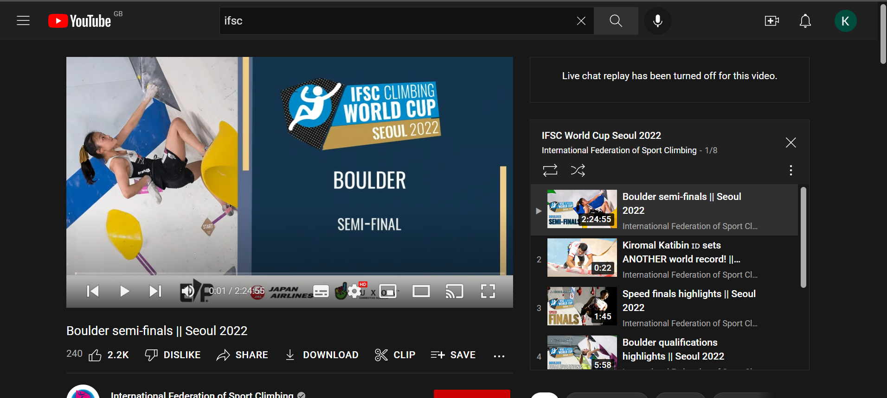
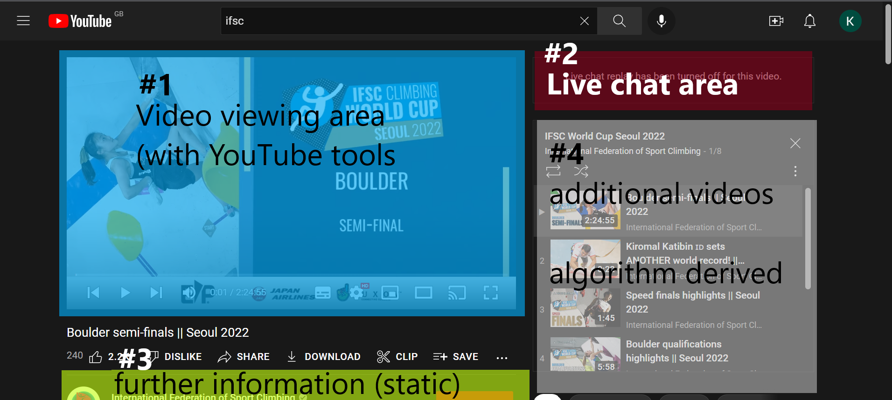

# International Federation of Sports Climbing competition viewing website

This projects goals are to design, develop and launch a website for viewing International Federation of Sports Climbing (IFSC) events, while providing information on the active climbers and a score in realtime. 

Events videos are hosted on YouTube, and YouTube will be the source of the videos. Additional functionality from YouTube will be required to enhance the viewer experience.

# User stories

1. I want to enter the site and easily be able to see the avalible competitions.

2. When I click on a competition I want to get an overview of current score, which climber is currently climbing and what the scores are.

3. As the contest progresses I want to be able to see the scoreboard update in real time.

4. I want to have access to the details of the current climber, including access to their social media sites.

5. I want my position saved so that if I leave the site and return I can continue watching at the position that I left.

# Site design, existing site research

For this section of project, I reviewed a number of existing sites for design ideas, assess them in terms of the user stories and looked at strengths and weaknesses.

## YouTube

YouTube is an American online video sharing and social media platform (Wikipedia) https://en.wikipedia.org/wiki/YouTube

YouTube is a highly popular and successful website for uploading and sharing videos. Youtube also has livesteaming services with a chat system, comments and other video suggestions

YouTubes layout is iconic and often imitated by other sites. As a site who's main goal is video sharing, additional features are present.

1. Video section with inbuilt tools

The largest single application area of the website, the video section comes with an inbuilt tool system for moving through the video, displaying subtitles and metrics.

2. Live chat area

There is a chat feature, that in real time allows people to communicate with each other while watching the video. In this specific circumstance the live chat is disabled.

3. Further information section (static design)

Below the video section is a summary of the video, there is an icon, and text + hyperlinks. This section is static, and while it can be expanded or contracted as required it will not change throughout the video

4. Additional videos (algorithm derived)

This area is either a. predeterimed list, or b. based on the YouTube of the next video to watch.

### YouTube assesment for project

from the required UserStories, YouTube has the following assesement

:heavy_check_mark: I want to enter the site and easily be able to see the avalible competitions.

:cross: When I click on a competition I want to get an overview of current score, which climber is currently climbing and what the scores are.

:cross: As the contest progresses I want to be able to see the scoreboard update in real time.

:cross: I want to have access to the details of the current climber, including access to their social media sites.

:heavy_check_mark: I want my position saved so that if I leave the site and return I can continue watching at the position that I left.

YouTube is inadequate for the user experience as it fails on the score section - requiring the score to be directly accessed outside the video field.

YouTube also has no links to climbers social media, but this could be added to the further information section, although this would clutter the section due to the non-dynamic nature of the section.

## Twitch.tv

Twitch is a livestreaming service that focuses in gaming, but has other areas such as music and just chatting.

### Twitch.tv assesment for project

from the required UserStories, YouTube has the following assesement

:heavy_check_mark: I want to enter the site and easily be able to see the avalible competitions.

:heavy_check_mark: When I click on a competition I want to get an overview of current score, which climber is currently climbing and what the scores are.

:cross: As the contest progresses I want to be able to see the scoreboard update in real time.

:heavy_check_mark: I want to have access to the details of the current climber, including access to their social media sites.

:heavy_check_mark: I want my position saved so that if I leave the site and return I can continue watching at the position that I left.

Twitch has a lot of features that match for the project

## Lolesport

Another esports site

:heavy_check_mark: I want to enter the site and easily be able to see the avalible competitions.

:heavy_check_mark: When I click on a competition I want to get an overview of current score, which climber is currently climbing and what the scores are.

:heavy_check_mark: As the contest progresses I want to be able to see the scoreboard update in real time.

:heavy_check_mark: I want to have access to the details of the current climber, including access to their social media sites.

:heavy_check_mark: I want my position saved so that if I leave the site and return I can continue watching at the position that I left.

The Lolesport website has all the features match

# Website design

The basic layout of the website will comprise 4 components

1. Navbar - floats at the top of the page while scrolling, will allow easy access to the menu.

2. Viewscreen - largest component, direct link to youtube video. Will shrink to bottom left of the screen if scrolled past to climber information section.

3. Current score - dynamically updated with video timestamp via external API.

4. Climber information panel - dynamically update with video timestamp via external API.

References

usehooks.com for basic REACT hooks
https://usehooks.com/useWindowSize/